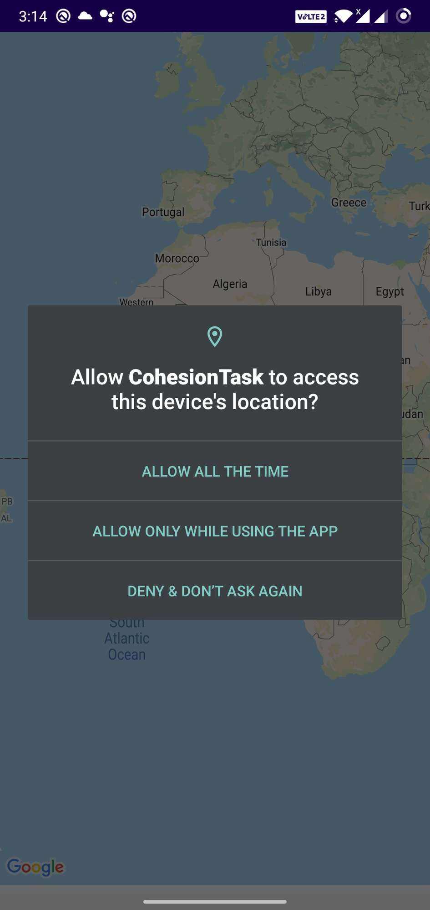
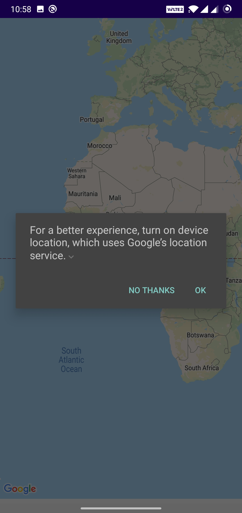
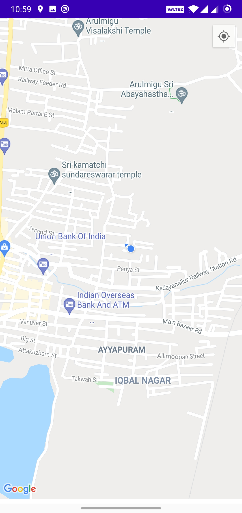
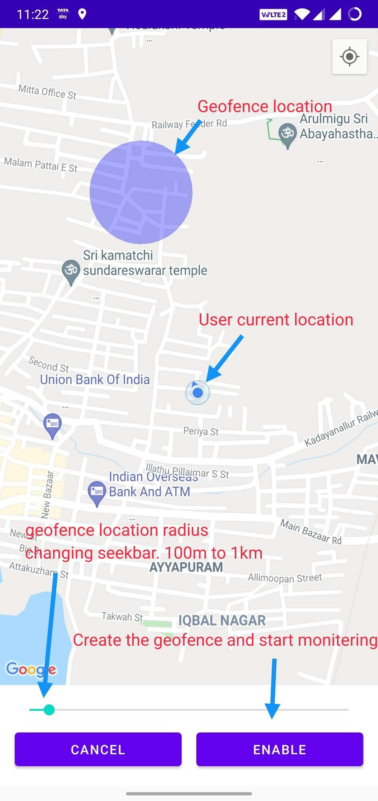
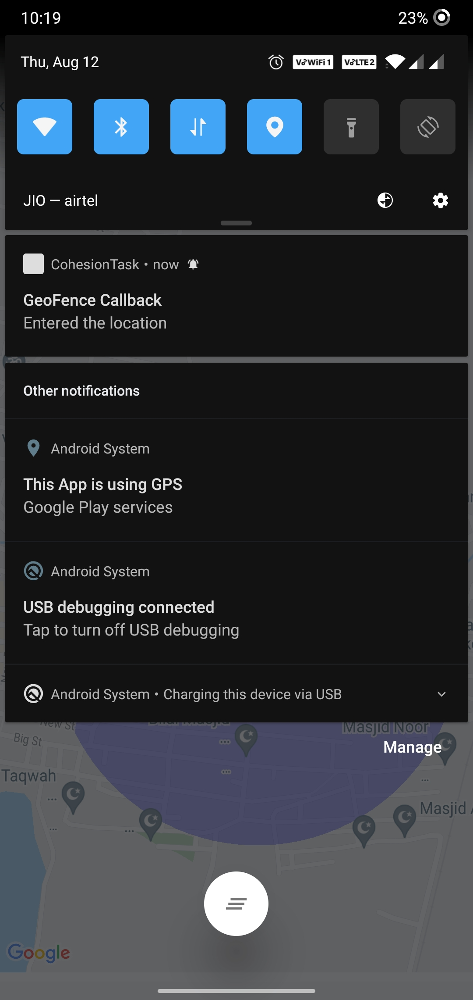

# GEOFENCING APPLICATION

## ABOUT 
By using this application, whenever the user navigates to or from the geofencing location the user is notified by a push notification

## TECHNOLOGIES USED
	Design Pattern : MVVM(Basic Architecture)
	Language       : Kotlin
	Google APIs    : GoogleMaps, GeoFencing, Firebase Crashlytics
	Others         : ViewBinding
  
## WORKFLOW 
 * When the user enters the app for the very first time, it asks for Location Permission (Need to give allow all).
  
 
 * When the user allows for accessing his location, the Enable Location Dialog is displayed.
  
  
 * When the user location is enabled, the map shows the exact current location of the user.
  
 
  * Whenever the user taps on any location, the user can enable the GeoFencing location for that tapped location in the map.
  * While tapping a location, the location is surrounded with radius of certain distance, it can be increased or decreased manually.
  * After selecting the location and then enable button is clicked.Now the geoFencing for that location is enabled
  
 
 * Now whenever the user navigates through that geofenced location i.e., the user may enter or exit that location, the user is notified with a popup notification.
 
